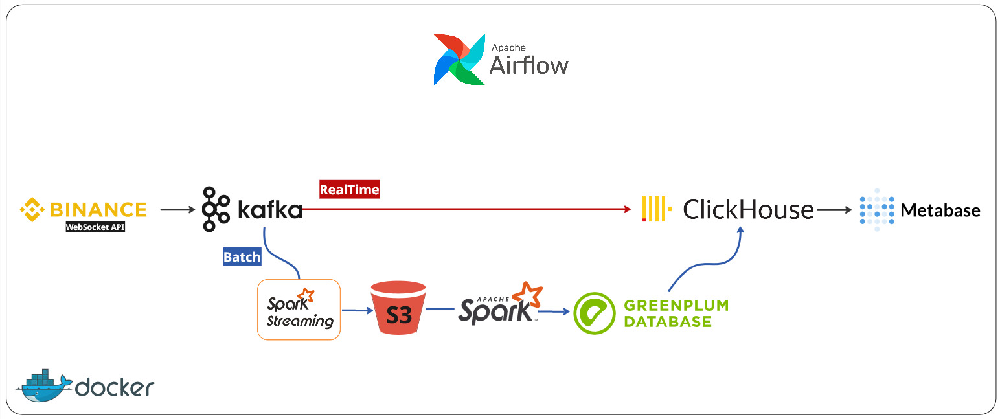
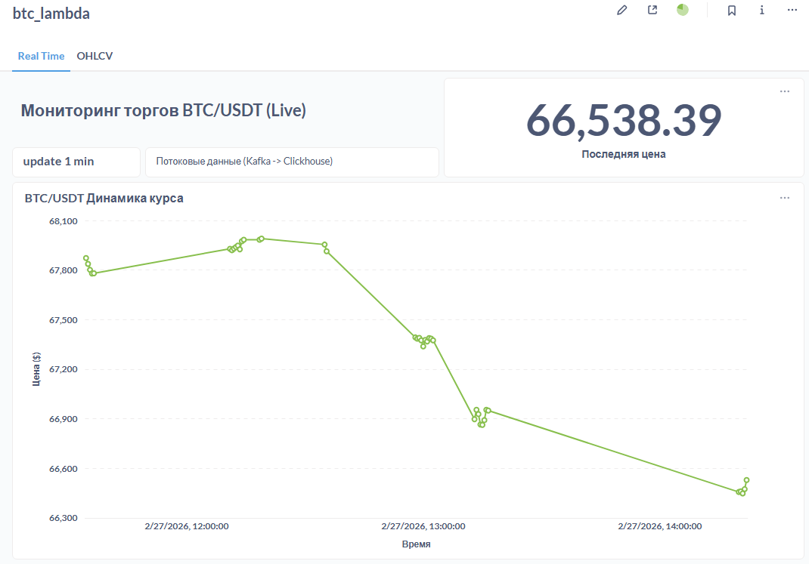
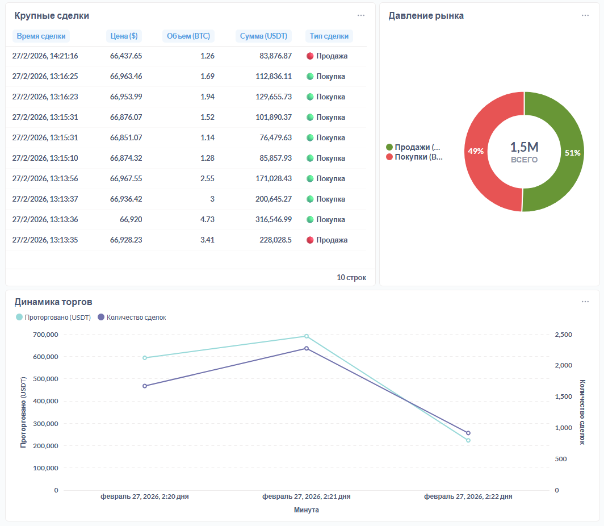
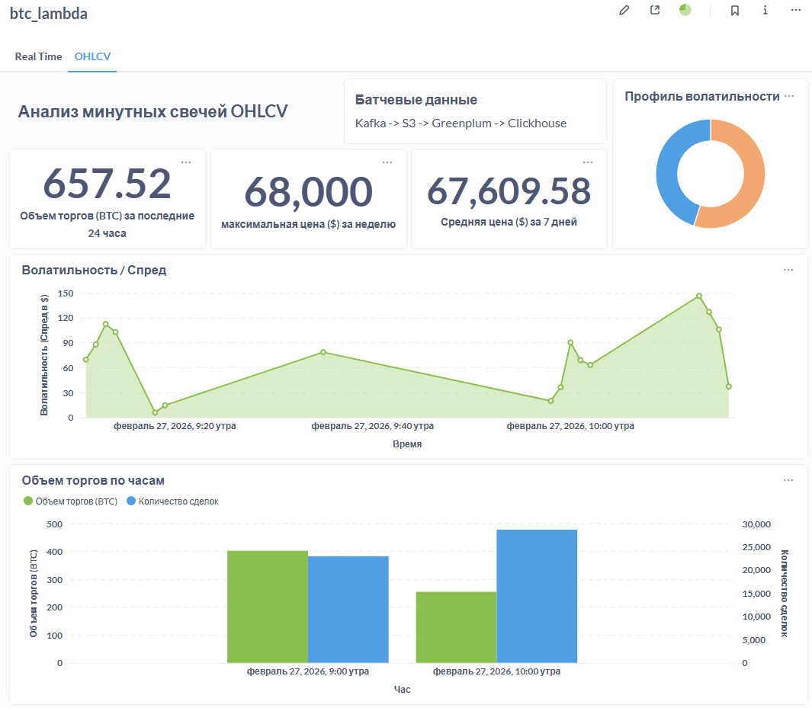

# 🪙 Пайплайн данных крипто рынка (Лямбда-архитектура)

End-to-end Data Engineering pet-проект, реализующий классическую **Lambda-архитектуру** для обработки криптовалютных сделок (BTC/USDT) с биржи Binance. Система обеспечивает как мгновенную аналитику, так и исторический анализ.

Пайплайн разделен на два независимых потока: 
1. **Realtime-слой:** Обработка потока сделок с минимальной задержкой.
2. **Batch-слой:** Надежное хранение сырых данных в S3, идемпотентные агрегации свечей (OHLCV) в Greenplum и защита от дублирования данных.

 

## 🛠 Стек

| **Компонент**     | **Технология**        | **Назначение**                            |
| ----------------- | --------------------- | ----------------------------------------- |
| **Source**        | Binance WebSocket API | Источник сырых данных о сделках           |
| **Ingestion**     | Python, Apache Kafka  | Продюсер и буфер сообщений                |
| **Processing**    | Apache Spark          | Потоковая обработка и запись в Batch-слое |
| **Lake / DWH**    | S3 (MinIO), Greenplum | Data Lake и основное хранилище (DWH)      |
| **Serving**       | ClickHouse            | Быстрая отдача данных для BI              |
| **Orchestration** | Apache Airflow        | Управление DAG'ами Batch-слоя             |
| **BI**            | Metabase              | Визуализация                              |

## 💡 Ключевые архитектурные решения

* **Идемпотентность и дедупликация:** Настроен перенос обработанных `.parquet` файлов в S3 `archive/` после успешной загрузки в Greenplum. Использование `ReplicatedReplacingMergeTree` в ClickHouse для устранения возможных дублей из Kafka.
* **"Выталкивание вычислений":** Агрегации (расчет минутных OHLCV свечей) перенесены на мощности MPP-кластера Greenplum (`INSERT ... SELECT`).
* **Хранение "холодных" данных:** Реализовано в S3 поверх с архивированием "холодных" данных.

## 📊 BI Дашборды (Metabase)

### 1. Real-time Мониторинг (RT слой)
Отображает текущую цену, динамику объемов за последний час, ленту "китовых" сделок и давление рынка (Покупки vs Продажи).

 


### 2. Исторический анализ OHLCV (Batch слой)
Отображает рассчитанные минутные японские свечи, волатильность (спред) и агрегированную статистику за 24ч/7д.

 

## 📁 Структура проекта
```
.
├── airflow/
│	├── dags/               # DAG'и (Kafka -> S3; S3 -> GP -> Clickhouse)
│	└── scripts/            # PySpark скрипты
├── sql/
│	├── clickhouse/
│	│   ├── ch_realtime.sql # DDL Realtime-слоя
│	│   └── ch_batch.sql    # DDL Batch-слоя
│	└── greenplum/
│	    └── gp_batch.sql    # DDL Хранилища и витрин
└── producer.py             # Скрипт забора данных из Binance API
└── example.env             # Переменные окружения
```

